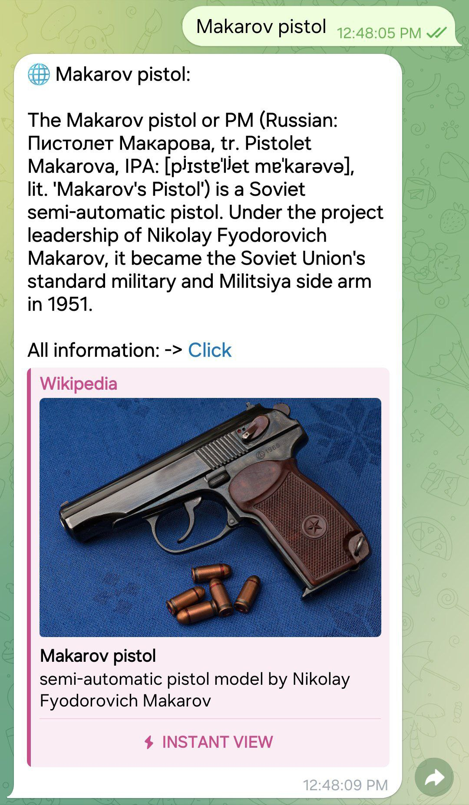

# Wikipedia Bot

## Description

Wikipedia Bot is a chatbot designed to fetch and deliver information from Wikipedia. Utilizing the Wikipedia API, the bot offers a user-friendly interface for searching and reading Wikipedia articles.

## Functionality

1. **Search for Information:** Users can search for articles on various topics, and the bot will return brief information about the found articles.
2. **Read Articles:** Users can request the full text of an article, and the bot will provide the entire content from Wikipedia.
3. **Links and Sources:** The bot includes links and sources related to the selected article, enabling users to delve deeper into the topic.

## Instructions for Use

1. **Installation:**
   - Clone the repository: `git clone https://github.com/kamolgks/wikipedia_bot.git`
   - Navigate to the project directory: `cd wikipedia_bot`
   - Install dependencies: `pip install -r requirements.txt`

2. **Bot Token with BotFather:**
   - Obtain your bot token from BotFather.
   - Add the bot token to the configuration file (`config.py`).

    ```python
    # config.py

    TOKEN = getenv("BOT_TOKEN", "Your bot token")
    ```

3. **Launching the Bot:**
   - Start the bot: `python main.py`
   - The bot is now ready to use in your chat.

## Usage Examples




## Contribution to the Project

To contribute, create a branch, make your changes, and submit a merge request.

## License

This project is licensed under the [GNU General Public License v3.0](LICENSE). You are free to use, modify, and distribute it under the terms of the license.

**Thank you for using Wikipedia Bot!**
